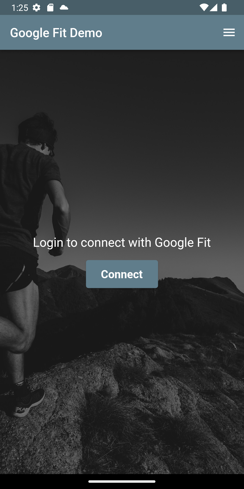
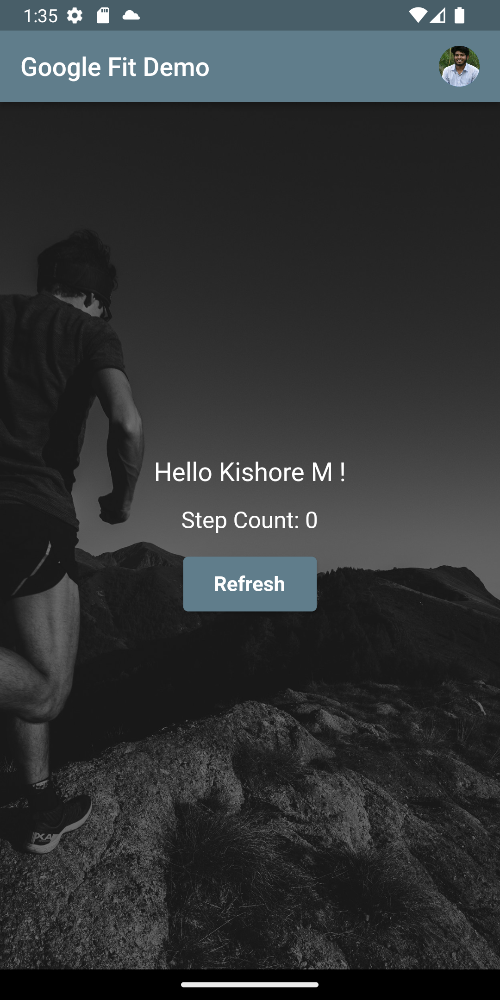
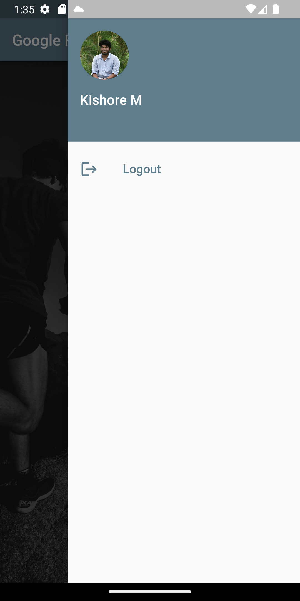

Google Fit Demo App

The Google Fit Demo App is a Flutter application that allows users to connect with their Google Fit account and retrieve their step count data. It provides a simple and intuitive interface for users to log in, view their step count, and log out.
Features

    Login with Google Fit: Users can connect their Google Fit account to the app using their Google credentials.
    Step Count Display: Once logged in, users can view their step count data retrieved from Google Fit.
    Refresh Step Count: Users can manually refresh their step count data by tapping the "Refresh Step Count" button.
    Logout: Users can log out of their Google Fit account and return to the login screen.

Screenshots

Login Screen
  
  

Step Count Screen

   
   
Logout Screen
   
   
Getting Started

Clone the repository:

    git clone https://github.com/kishore280/Demo.git

Navigate to the project directory:

     cd google_fit_demo

Install dependencies:

     flutter pub get

Run the app:

    flutter run

Dependencies

The app uses the following dependencies:

    flutter/material.dart: The core Flutter framework for building user interfaces.
    google_sign_in/google_sign_in.dart: Flutter plugin for Google Sign-In.
    http/http.dart: Flutter package for making HTTP requests.
    dart:convert: Package for encoding and decoding JSON data.

Contributions

Contributions to the Google Fit Demo App are welcome! If you find any issues or have suggestions for improvements, please feel free to open an issue or submit a pull request.
License

The Google Fit Demo App is open-source and released under the MIT License. Feel free to modify and use the code for your own projects.
Disclaimer

This app is a demonstration project and not intended for production use. It may not have complete error handling or security measures. Use it at your own risk.